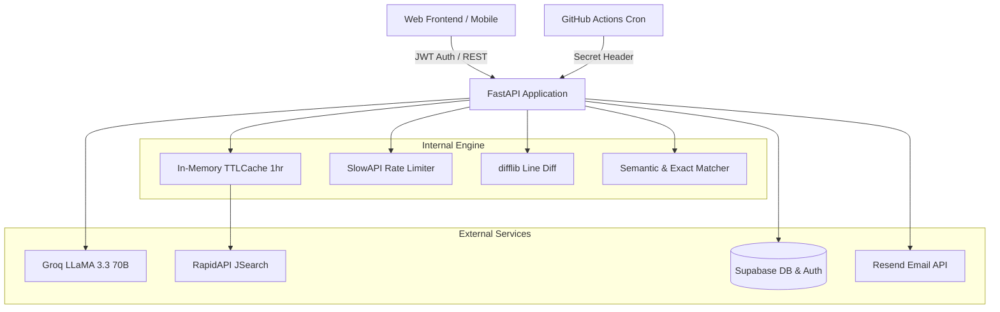

# AI Job Matcher & Career Co-Pilot API 🚀

A production-ready FastAPI backend designed to parse resumes, query real-time job listings, perform semantic & set-based skill matching, tailor resumes, track applications, and deliver automated daily job digests.

---

## 🏛 System Architecture



---

## ✨ Features Implemented

### 1. Resume Parsing & Optimization
- **`/parse-resume`**: Extracts raw text with `pdfplumber` and derives core technical skills using Groq LLaMA-3.3.
- **`/optimize-resume`**: Seamlessly incorporates missing skills without fabricating experience.
- **`/tailor-resume`**: Reframes bullet points and keywords specifically for a target job description.
- **`/diff-resume`**: Side-by-side line-by-line diff viewer comparing original vs tailored resumes.

### 2. Job Search, Skill Matching & Interview Prep
- **`/fetch-jobs`**: Real-time job listings with in-memory TTL caching (1 hour) to conserve RapidAPI quota.
- **`/match`**: Fast, exact keyword intersection scoring.
- **`/semantic-match`**: LLM-driven semantic relevance scoring (e.g. *React* ↔ *frontend frameworks*).
- **`/interview-prep`**: Generates tailored technical questions, behavioral prompts, and skill-gap defense strategies.
- **`/ats-score`**: Evaluates resume suitability against a job description with actionable tips.

### 3. Auth, Persistence & Application Tracking
- **JWT Verification**: Verifies Supabase tokens via public JWKS (ES256 & RS256).
- **`/resume`** & **`/resume/save`**: Persistent user resume storage.
- **`/searches`** & **`/searches/save`**: Saved query bookmarks.
- **`/tracker`**: Full Kanban board CRUD (`saved` → `applied` → `interview` → `offer` / `rejected`).

### 4. Automated Daily Digest & Assisted Apply
- **`/run-digest`**: Triggered daily by GitHub Actions cron. Fetches listings, scores against saved skills, deduplicates via `sent_jobs`, and emails the top 10 matches via Resend.
- **`/apply-pack`**: One-click generation of tailored resume, customized outreach email, application link, and quality checklist.

---

## 🛠 Local Setup

### 1. Clone & create virtual environment
```bash
git clone https://github.com/SubhadipMajee/ai-job-matcher-backend.git
cd ai-job-matcher-backend

python -m venv venv
# Windows:
.\venv\Scripts\Activate.ps1
# Mac/Linux:
source venv/bin/activate
```

### 2. Install dependencies
```bash
pip install -r requirements.txt
pip install pytest pytest-asyncio
```

### 3. Configure environment variables (`.env`)
```env
GROQ_API_KEY=your_groq_api_key
JSEARCH_API_KEY=your_jsearch_rapidapi_key
SUPABASE_URL=https://your-project.supabase.co
SUPABASE_SERVICE_KEY=your_supabase_secret_key
RESEND_API_KEY=re_your_resend_key
FROM_EMAIL=onboarding@resend.dev
DIGEST_SECRET=your_secret_digest_token
```

### 4. Run database migrations
Execute `migration.sql` in your **Supabase SQL Editor** to create `user_profiles`, `saved_searches`, `saved_jobs`, `applications`, `digest_settings`, and `sent_jobs` tables with Row Level Security.

### 5. Start development server
```bash
uvicorn api:app --reload --host 0.0.0.0 --port 8000
```
Interactive Swagger docs: `http://localhost:8000/docs`

---

## 🧪 Testing

Run test suite:
```bash
pytest -v
```
All unit tests and API integration tests run automatically on GitHub Actions CI.